<!--
  Marcin Sufa — GitHub profile README
  Implemented from the Claude Design "GitHub README - Final.dc.html".
  The hero is a self-contained animated SVG (assets/banner.svg) — fonts + avatar
  are inlined as data: URIs so it renders on GitHub, where SVGs load as .
-->

 

Full-stack developer from Poland. I ship Vue / Nuxt / React frontends and Node APIs —
and I'm all-in on AI tooling, building command-line tools that make coding agents genuinely useful.

 

       

 

<h3 align="center">🚀 &nbsp;Products</h3>

<table>
  <tr>
    <td width="33%" valign="top" align="center">
       
      <b><a href="https://exovault.co">ExoVault</a></b> 
      exovault.co · MCP · E2E
      
Encrypted, multimodal memory for AI agents over MCP — a persistent mind, consolidated nightly. Zero-knowledge.

    </td>
    <td width="33%" valign="top" align="center">
       
      <b><a href="https://asistel.pl">Asistel</a></b> 
      asistel.pl · Voice-AI · PL
      
Voice-AI phone assistant for multi-branch businesses. Answers missed calls in Polish and logs callbacks for your team.

    </td>
    <td width="33%" valign="top" align="center">
       
      <b>Fractal</b> 🔒 
      Electron · Multi-agent · private
      
Desktop cockpit for orchestrating parallel coding agents — cross-model write + review, agent-to-agent comms, one window over many Claude Code sessions.

    </td>
  </tr>
</table>

<h3 align="center">🛠 &nbsp;Claude Code tools</h3>

<table>
  <tr>
    <td width="33%" valign="top">
      
      <a href="https://github.com/MarcinSufa/claude-watch-video"><code>claude-watch-video</code></a>
      
Make Claude watch any video — frames + Whisper into a paste-ready evidence bundle.

    </td>
    <td width="33%" valign="top">
      
      <a href="https://github.com/MarcinSufa/git-timesheet"><code>git-timesheet</code></a>
      
Weekly PDF/CSV timesheets generated straight from your git commit history.

    </td>
    <td width="33%" valign="top">
      
      <a href="https://github.com/MarcinSufa/claude-demo-video"><code>claude-demo-video</code></a>
      
Turn your app into a ~50s product film — real UI capture, AI voiceover, synced captions &amp; music. Runs free, locally.

    </td>
  </tr>
</table>

 

   

